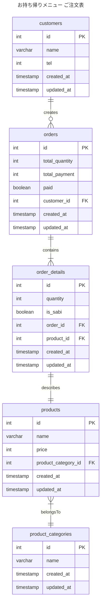

```mermaid
---
title: お持ち帰りメニュー ご注文表
---
erDiagram

    customers ||--o{ orders : creates
    orders ||--|{ order_details : contains
    order_details ||--|| products : describes
    products }|--|| product_categories : belongsTo

    customers {
        int id PK
        varchar name
        int tel
        timestamp created_at
        timestamp updated_at
    }

    orders {
        int id PK
        int total_quantity
        int total_payment
        boolean paid
        int customer_id FK
        timestamp created_at
        timestamp updated_at
    }

    order_details {
        int id PK
        int quantity
        boolean is_sabi
        int order_id FK
        int product_id FK
        timestamp created_at
        timestamp updated_at
    }

    products {
        int id PK
        varchar name
        int price
        int product_category_id FK
        timestamp created_at
        timestamp updated_at
    }

    product_categories {
        int id PK
        varchar name
        timestamp created_at
        timestamp updated_at
    }
```
