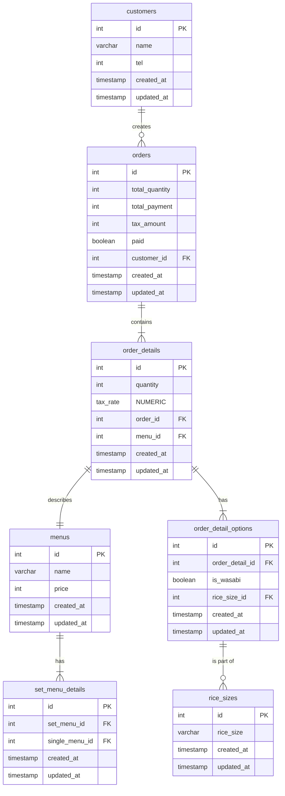

## ERD


```mermaid
erDiagram

    customers ||--o{ orders : creates
    orders ||--|{ order_details : contains
    order_details ||--|| menus : describes
    order_details ||--|{ order_detail_options : "has"
    order_detail_options ||--o{ rice_sizes : "is part of"
    menus ||--|{ set_menu_details : "has"

    customers {
        int id PK
        varchar name
        int tel
        timestamp created_at
        timestamp updated_at
    }

    orders {
        int id PK
        int total_quantity
        int total_payment
        int tax_amount
        boolean paid
        int customer_id FK
        timestamp created_at
        timestamp updated_at
    }

    order_details {
        int id PK
        int quantity
        tax_rate NUMERIC
        int order_id FK
        int menu_id FK
        timestamp created_at
        timestamp updated_at
    }

    order_detail_options {
        int id PK
        int order_detail_id FK
        boolean is_wasabi
        int rice_size_id FK
        timestamp created_at
        timestamp updated_at
    }

    rice_sizes {
        int id PK
        varchar rice_size
        timestamp created_at
        timestamp updated_at
    }

    menus {
        int id PK
        varchar name
        int price
        timestamp created_at
        timestamp updated_at
    }

    set_menu_details {
        int id PK
        int set_menu_id FK
        int single_menu_id FK
        timestamp created_at
        timestamp updated_at
    }
```
## DDL
- src/ddl.sqlを参照

## メモ
- ddlファイルの実行
``` 
docker cp /path/to/ddl.sql mysql_container:/ddl.sql
docker exec -it mysql_container mysql -u root -p
SOURCE /ddl.sql;
```
